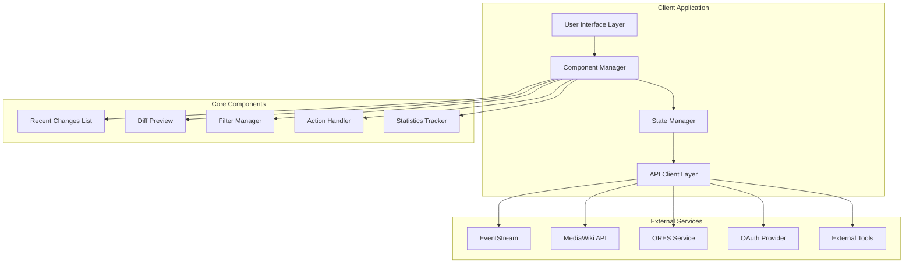
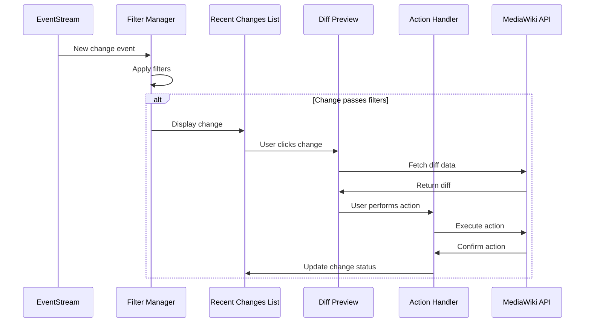

# Design Document: Wikipedia Patrol Tool

## Overview

The Wikipedia Patrol Tool is a modern, modular web application that replaces the outdated LiveRC tool for Wikipedia patrolling. Built with JavaScript and leveraging the latest MediaWiki APIs, the system provides real-time change monitoring, intelligent filtering, and comprehensive moderation tools for volunteer patrollers.

The application follows a component-based architecture with a modular interface using golden-layout or similar framework, enabling customizable layouts and efficient workflow management. The system integrates deeply with MediaWiki's EventStream for real-time updates, ORES for automated quality scoring, and various external tools for enhanced functionality.

## Architecture

### High-Level Architecture



### Component Architecture

The application uses a modular component system where each major functionality is encapsulated in independent, reusable components:

- **Layout Manager**: Handles window management and component positioning using golden-layout
- **Event System**: Manages inter-component communication and state synchronization
- **API Abstraction**: Provides unified interface to all external services
- **State Management**: Centralized application state with reactive updates

### Data Flow



## Components and Interfaces

### Core Components

#### 1. EventStream Manager
**Purpose**: Manages real-time connection to MediaWiki EventStream
**Interface**:
```javascript
class EventStreamManager {
    connect(wikis: string[]): Promise<void>
    disconnect(): void
    pause(): void
    resume(): void
    onNewChange(callback: (change: Change) => void): void
    getConnectionStatus(): ConnectionStatus
}
```

#### 2. Filter Manager
**Purpose**: Applies filtering criteria to incoming changes
**Interface**:
```javascript
class FilterManager {
    setUserFilters(criteria: UserFilterCriteria): void
    setNamespaceFilters(namespaces: number[]): void
    setOresFilters(minScore: number, maxScore: number): void
    setWhitelist(users: string[], tags: string[]): void
    setBlacklist(users: string[], tags: string[]): void
    applyFilters(change: Change): boolean
    exportFilters(): FilterConfiguration
    importFilters(config: FilterConfiguration): void
}
```

#### 3. Recent Changes List Component
**Purpose**: Displays filtered changes with interactive functionality
**Interface**:
```javascript
class RecentChangesList {
    addChange(change: Change): void
    removeChange(changeId: string): void
    markAsReviewed(changeId: string): void
    hideChange(changeId: string): void
    clearList(): void
    selectChange(changeId: string): void
    getSelectedChange(): Change | null
    onChangeClick(callback: (change: Change) => void): void
}
```

#### 4. Diff Preview Component
**Purpose**: Displays diff comparisons with navigation and interaction
**Interface**:
```javascript
class DiffPreview {
    loadDiff(pageTitle: string, oldRevId: number, newRevId: number): Promise<void>
    navigateToNext(): void
    navigateToPrevious(): void
    selectText(startPos: number, endPos: number): void
    onTextSelection(callback: (selectedText: string) => void): void
    showImagePreview(imageUrl: string): void
}
```

#### 5. Action Handler
**Purpose**: Manages user actions on changes, users, and pages
**Interface**:
```javascript
class ActionHandler {
    revertEdit(revisionId: number, reason: string): Promise<ActionResult>
    blockUser(username: string, duration: string, reason: string): Promise<ActionResult>
    sendUserMessage(username: string, template: string, params: object): Promise<ActionResult>
    deletePage(pageTitle: string, reason: string): Promise<ActionResult>
    protectPage(pageTitle: string, level: string, reason: string): Promise<ActionResult>
    addToWatchlist(pageTitle: string): Promise<ActionResult>
    markAsReviewed(revisionId: number): Promise<ActionResult>
    hideRevision(revisionId: number, reason: string): Promise<ActionResult>
}
```

#### 6. User Information Manager
**Purpose**: Retrieves and manages user-related data
**Interface**:
```javascript
class UserInfoManager {
    getUserInfo(username: string): Promise<UserInfo>
    getContributions(username: string, limit: number): Promise<Contribution[]>
    getBlockHistory(username: string): Promise<Block[]>
    getWhoisInfo(ipAddress: string): Promise<WhoisInfo>
    checkIPQuality(ipAddress: string): Promise<IPQualityScore>
    getUserWarnings(username: string): Promise<Warning[]>
}
```

### External Service Integrations

#### MediaWiki API Client
```javascript
class MediaWikiAPI {
    authenticate(oauthToken: string): Promise<void>
    query(params: QueryParams): Promise<APIResponse>
    edit(pageTitle: string, content: string, summary: string): Promise<EditResult>
    delete(pageTitle: string, reason: string): Promise<DeleteResult>
    block(username: string, options: BlockOptions): Promise<BlockResult>
    protect(pageTitle: string, options: ProtectOptions): Promise<ProtectResult>
    checkUserRights(username: string): Promise<UserRights>
}
```

#### ORES Integration
```javascript
class ORESClient {
    getRevisionScore(revisionId: number): Promise<ORESScore>
    getBatchScores(revisionIds: number[]): Promise<Map<number, ORESScore>>
    getModelInfo(wiki: string): Promise<ModelInfo>
}
```

## Data Models

### Core Data Structures

#### Change Model
```javascript
interface Change {
    id: string
    timestamp: Date
    wiki: string
    namespace: number
    pageTitle: string
    revisionId: number
    oldRevisionId: number
    user: string
    userType: 'registered' | 'ip' | 'bot'
    editSummary: string
    byteDifference: number
    tags: string[]
    oresScore?: number
    isMinor: boolean
    isNew: boolean
    isBot: boolean
    patrolled: boolean
    reviewed: boolean
}
```

#### User Information Model
```javascript
interface UserInfo {
    username: string
    userType: 'registered' | 'ip' | 'bot'
    registrationDate?: Date
    editCount: number
    blockHistory: Block[]
    userGroups: string[]
    isAutoconfirmed: boolean
    sessionReverts: number
    lastActive: Date
    warnings: Warning[]
}
```

#### Filter Configuration Model
```javascript
interface FilterConfiguration {
    userFilters: {
        minEditCount: number
        maxEditCount: number
        minAccountAge: number
        userTypes: UserType[]
        excludeAutoconfirmed: boolean
    }
    namespaceFilters: number[]
    oresFilters: {
        enabled: boolean
        minScore: number
        maxScore: number
    }
    whitelist: {
        users: string[]
        tags: string[]
    }
    blacklist: {
        users: string[]
        tags: string[]
    }
    overrides: {
        showOwnEdits: boolean
        showReverts: boolean
        showBlanking: boolean
        showWatchlistPages: boolean
    }
}
```

#### Action Result Model
```javascript
interface ActionResult {
    success: boolean
    message: string
    data?: any
    errors?: string[]
    warnings?: string[]
}
```

### State Management

The application uses a centralized state management system with reactive updates:

```javascript
interface ApplicationState {
    connection: {
        status: 'connected' | 'disconnected' | 'connecting'
        activeWikis: string[]
        paused: boolean
    }
    changes: {
        list: Change[]
        selected: string | null
        hidden: Set<string>
        reviewed: Set<string>
    }
    filters: FilterConfiguration
    user: {
        authenticated: boolean
        username: string
        rights: string[]
        preferences: UserPreferences
    }
    session: {
        startTime: Date
        reviewedCount: number
        revertedCount: number
        actionsPerformed: ActionSummary[]
    }
    ui: {
        layout: LayoutConfiguration
        activeComponents: string[]
        notifications: Notification[]
    }
}
```

## Error Handling

### Error Categories

1. **Network Errors**: Connection failures, timeouts, API unavailability
2. **Authentication Errors**: OAuth failures, permission denied, token expiration
3. **Validation Errors**: Invalid input, malformed requests, constraint violations
4. **Business Logic Errors**: Action conflicts, state inconsistencies, rule violations

### Error Handling Strategy

```javascript
class ErrorHandler {
    handleNetworkError(error: NetworkError): void {
        // Implement retry logic with exponential backoff
        // Show user-friendly connection status
        // Queue actions for retry when connection restored
    }
    
    handleAuthError(error: AuthError): void {
        // Redirect to OAuth re-authentication
        // Preserve current session state
        // Resume operations after re-auth
    }
    
    handleValidationError(error: ValidationError): void {
        // Show specific field errors to user
        // Prevent invalid actions from being submitted
        // Provide correction suggestions
    }
    
    handleBusinessLogicError(error: BusinessLogicError): void {
        // Show contextual error messages
        // Suggest alternative actions
        // Log for debugging and improvement
    }
}
```

### Resilience Patterns

- **Circuit Breaker**: Prevent cascading failures from external services
- **Retry with Backoff**: Handle transient network issues gracefully
- **Graceful Degradation**: Continue core functionality when non-critical services fail
- **State Persistence**: Preserve user work during unexpected failures

## Testing Strategy

The testing strategy employs a dual approach combining unit tests for specific functionality and property-based tests for comprehensive validation of system behavior.

### Unit Testing Approach

Unit tests focus on:
- Component integration points and API interactions
- Specific user workflow scenarios and edge cases
- Error handling and recovery mechanisms
- Authentication and authorization flows
- External service integration reliability

### Property-Based Testing Approach

Property-based tests validate universal system properties using a minimum of 100 iterations per test. Each test references specific design properties and validates requirements through randomized input generation.

**Testing Framework**: Use fast-check for JavaScript property-based testing
**Configuration**: Minimum 100 iterations per property test
**Tagging**: Each test tagged with **Feature: wikipedia-patrol-tool, Property {number}: {property_text}**

The comprehensive testing approach ensures both concrete functionality validation through unit tests and universal correctness guarantees through property-based verification, providing robust quality assurance for the patrolling tool.

## Correctness Properties

*A property is a characteristic or behavior that should hold true across all valid executions of a system—essentially, a formal statement about what the system should do. Properties serve as the bridge between human-readable specifications and machine-verifiable correctness guarantees.*

Based on the prework analysis and property reflection to eliminate redundancy, the following properties ensure the Wikipedia Patrol Tool operates correctly across all scenarios:

### Property 1: Real-time Change Processing
*For any* sequence of changes from EventStream, when the system is not paused, all changes should appear in the changes list in the order they were received
**Validates: Requirements 1.2**

### Property 2: Pause and Resume State Consistency  
*For any* system state, pausing should stop new change display while maintaining connection, and resuming should restore normal change processing
**Validates: Requirements 1.3, 1.4**

### Property 3: Multi-wiki Monitoring Capability
*For any* set of valid wiki configurations, the system should successfully monitor all specified wikis simultaneously without data mixing
**Validates: Requirements 1.5**

### Property 4: Comprehensive Filtering Consistency
*For any* combination of filter criteria (user, namespace, ORES, whitelist/blacklist), only changes matching all active filters should be displayed in the changes list
**Validates: Requirements 2.1, 2.2, 2.3, 2.4**

### Property 5: Change Information Completeness
*For any* change displayed in the system, all required information fields (timestamp, author, page title, edit summary, byte difference, tags) should be present and correctly formatted
**Validates: Requirements 2.5**

### Property 6: Interactive Change Selection
*For any* change line in the list, clicking it should immediately open the corresponding diff preview with correct revision data
**Validates: Requirements 2.6**

### Property 7: User Information Display Completeness
*For any* user (registered or IP), the system should display all available information fields (username/IP, status, block history, contribution count, session statistics) when requested
**Validates: Requirements 3.1, 3.2**

### Property 8: IP Address Tool Integration
*For any* valid IP address, the system should provide access to Whois lookup and IP quality assessment tools with appropriate data
**Validates: Requirements 3.5**

### Property 9: Diff Display and Navigation Consistency
*For any* page revision pair, the diff display should show clear version comparison and support keyboard navigation between related diffs
**Validates: Requirements 4.1, 4.2, 4.5**

### Property 10: Media and Text Interaction Features
*For any* diff containing images or selectable text, the system should provide hover preview for images and right-click search functionality for selected text
**Validates: Requirements 4.3, 4.4**

### Property 11: Page Template Selection Logic
*For any* page type and maintenance issue combination, the system should offer relevant banner templates that match the page characteristics
**Validates: Requirements 5.2**

### Property 12: Watchlist and External Tool Integration
*For any* valid page, adding to watchlist should confirm addition and update the user's watchlist, and copyvio detection should integrate correctly with Earwig's tool
**Validates: Requirements 5.4, 5.5**

### Property 13: Action Execution with Permission Validation
*For any* user action (revert, block, hide), the system should verify user permissions before execution and complete the action with appropriate summaries and confirmations
**Validates: Requirements 6.1, 6.5**

### Property 14: Change Status Management
*For any* change in the system, marking as reviewed should update the status correctly and optionally hide from view based on user preferences
**Validates: Requirements 6.2**

### Property 15: Combined Action Coordination
*For any* valid action combination (revert + message, block + message), the system should execute all components successfully and maintain consistency
**Validates: Requirements 6.3**

### Property 16: Session State Persistence
*For any* patrolling session, the system should maintain accurate history of reviewed diffs and preserve session statistics when the session ends
**Validates: Requirements 7.1, 7.4**

### Property 17: Real-time Statistics and Notifications
*For any* system activity or incoming notification (talk page messages, thanks), the system should update statistics displays and provide visual notifications immediately
**Validates: Requirements 7.2, 7.3, 7.5**

### Property 18: Keyboard Shortcut Consistency
*For any* valid keyboard shortcut in any system context, the corresponding action should execute immediately with the same behavior as mouse-based interaction
**Validates: Requirements 8.1, 8.2, 8.3, 8.4, 8.5**

### Property 19: Permission Management and Updates
*For any* user permission change or privileged action attempt, the system should verify current permissions and update available actions dynamically
**Validates: Requirements 9.2, 9.3**

### Property 20: Authentication State Preservation
*For any* authentication expiry event, the system should prompt for re-authentication while preserving all session data and maintaining secure communication
**Validates: Requirements 9.4, 9.5**

### Property 21: Cross-wiki Configuration Isolation
*For any* wiki switch operation, the system should maintain separate filter settings and session data for each wiki without cross-contamination
**Validates: Requirements 10.1**

### Property 22: Configuration Persistence and Import
*For any* valid configuration change or import operation, the system should preserve user preferences across sessions and wiki switches while supporting external configuration sources
**Validates: Requirements 10.2, 10.3, 10.5**

### Property 23: Wiki-specific Action Adaptation
*For any* wiki with specific policies, the system should adapt available actions and options to match that wiki's requirements and restrictions
**Validates: Requirements 10.4**